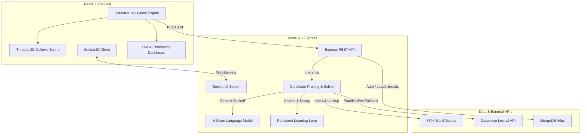

# Hangman AI 🕵️‍♂️🎯

A full-stack, real-time Hangman web application featuring a character-level **Statistical N-Gram Language Model**, real-time **WebSockets multiplayer**, an interactive **3D animated game board**, and a live **AI Reasoning Explainer** dashboard.

🌐 **Live Demo:** [https://hangman-ai-orpin.vercel.app/](https://hangman-ai-orpin.vercel.app/)

---

## 🏗️ Architecture & Technology Stack



- **Frontend:** React 19, Vite, TailwindCSS, Three.js, Lucide Icons, Canvas Confetti.
- **Backend:** Node.js, Express, Socket.IO, Zod schema validation.
- **AI Engine:** Character-level N-Gram statistical language model (Order-2 $\rightarrow$ Order-1 $\rightarrow$ Positional $\rightarrow$ Global backoff) + dynamic candidate entropy filtering.
- **Persistence & Fallback:** MongoDB Atlas (Mongoose) with graceful in-memory fallback for guest sessions.

---

## 🎮 Game Modes

| Mode | Type | Description |
| :--- | :--- | :--- |
| **Solo** | Player vs AI | The AI chooses a word from curated difficulty buckets; the player investigates. |
| **Reverse** | AI vs Player | The player inputs any secret word (including slang/proper nouns); the AI attempts to deduce it within 6 strikes using candidate reasoning and live Datamuse queries. |
| **Local Duel** | 2 Players | Pass-and-play on a single device with secret word input and turn tracking. |
| **Multiplayer** | Real-Time Online | Live WebSocket rooms with matchmaking, shared game state, and role swaps. |

---

## 🧠 AI Solver & Linguistic Engine

1. **Character-Level N-Gram Context Model:**
   Trained on a 370,000+ word corpus at boot time. Uses bi-gram and tri-gram character contexts to predict missing letters based on neighboring revealed letters (e.g. knowing `Q` is followed by `U`, or recognizing common prefixes/suffixes like `TH`, `ING`, `ED`).

2. **Positional Frequency Matrices:**
   Instead of flat letter frequency, the AI computes exact slot likelihoods per word length (e.g. knowing letter frequency at position 1 vs position 5).

3. **Blank-Slot Multi-Occurrence Weighting:**
   Evaluates how many unresolved blanks a letter fills across matching candidates, rewarding high-information guesses that resolve multiple letters at once.

4. **Live Datamuse Parallel Fallback:**
   In Reverse mode, when players enter modern slang or proper nouns (e.g., `DIDDY`), the engine concurrently queries the Datamuse Lexical API to expand candidate sets in real time.

5. **Adaptive Learning Loop:**
   When the AI loses a match, failed letters are recorded to `ai_learning.json`. Future games scale down failed letters by up to 95%, forcing the solver to pivot to alternative consonant/vowel clusters.

---

## 📊 AI Benchmark Performance

Evaluated across production word sets (`SAMPLE_SIZE = 100` per tier):

| Difficulty | Word Length | Win Rate | Avg Turns | Avg Wrong Guesses | Latency |
| :--- | :---: | :---: | :---: | :---: | :---: |
| **Rookie (Easy)** | 4 – 5 letters | **64.0%** | 7.4 | 3.9 | < 2 ms |
| **Detective (Medium)** | 6 – 7 letters | **88.0%** | 8.2 | 2.6 | < 15 ms |
| **Chief (Hard)** | 8 – 10 letters | **94.0%** | 8.9 | 1.8 | < 30 ms |

---

## 🚀 Getting Started

### Prerequisites
- Node.js 18+
- npm or yarn

### 1. Clone the Repository
```bash
git clone https://github.com/salim7-s/Hangman-AI.git
cd Hangman-AI
```

### 2. Backend Setup
```bash
cd backend
npm install
npm run dev
```

**Environment Variables (`backend/.env`):**
```env
PORT=5000
CLIENT_URL=http://localhost:5173
MONGO_URI=mongodb+srv://<username>:<password>@cluster.mongodb.net/hangman
JWT_SECRET=your_jwt_secret_key
```
*(Note: `MONGO_URI` is optional; backend defaults to in-memory store if omitted.)*

### 3. Frontend Setup
```bash
cd ../frontend
npm install
npm run dev
```

Open [http://localhost:5173](http://localhost:5173) in your browser.

---

## 🧪 Testing & Verification

```bash
# Run all backend regression tests (26 specs)
npm test

# Run frontend ESLint checks
npm run lint

# Build production bundle
npm run build
```

---

## 📁 Repository Structure

```text
hangman-ai/
├── backend/
│   ├── config/          # MongoDB connection & non-fatal fallback
│   ├── controllers/     # REST game, auth, and explain handlers
│   ├── data/            # 370k word corpus, curated gameplay words, blocklists
│   ├── routes/          # Express API endpoints
│   ├── services/        # N-Gram language model & AI solving logic
│   ├── socket/          # Socket.IO multiplayer room engine
│   └── test/            # 26 automated regression tests
├── frontend/
│   ├── src/components/  # Detective UI, 3D Canvas, Modals, Explainer
│   ├── src/context/     # Auth and theme context providers
│   ├── src/hooks/       # Custom hooks for game state and WebSockets
│   └── src/pages/       # Route views (Home, Game, Multiplayer, Leaderboard)
├── docs/                # Architecture, API references & presentation slides
└── scripts/             # Word curation and validation utilities
```

---

## 📄 License
This project is open source and available under the [MIT License](LICENSE).
