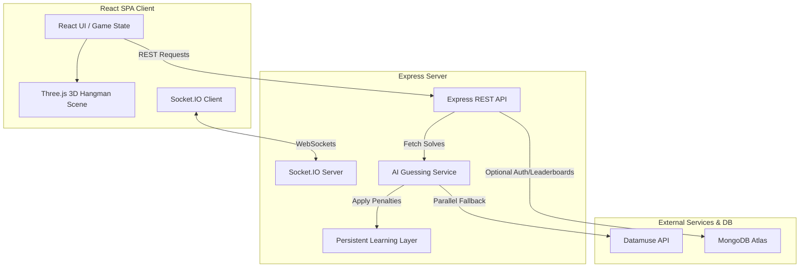

# Hangman AI

Hangman AI is a full-stack, real-time word game built with React, Node.js, Express, Socket.IO, and optional MongoDB persistence. The project includes solo play, local pass-and-play, real-time multiplayer rooms, and an AI guesser with Rookie, Detective, and Chief difficulty modes.

## System Architecture



## Core Features

- **AI-vs-Player Mode:** The server picks target words for the player.
- **Player-vs-AI Mode:** The AI acts as the investigator, guessing your word.
- **Persistent AI Learning Loop:** After each loss, the AI records wasted letters to a local JSON feedback store, applying decay-weighted penalties in future sessions to dynamically adapt its strategy.
- **Web-Assisted Parallel Fallback:** Resolves slang, names, and out-of-dictionary terms by query-matching local indexes and the Datamuse API concurrently.
- **AI Explainer Dashboard:** Interactive live UI reflecting candidate-pools, heuristics, and individual letter score calculations.
- **Real-Time Multiplayer:** Matchmaking lobby via Socket.IO, complete with state replication and room role-swaps.
- **JWT Auth & Persistence:** Mongoose-backed authorization flow with transparent fallback to in-memory tables if database configuration is omitted.

## Persistent Learning Loop Details

The AI has a self-improving feedback loop built into its guessing service:
1. **Wrong Guess Analysis:** When the AI loses a game, it isolates all of its wrong guesses (wasted turns).
2. **Keyed Learning Store:** It records these failures to `ai_learning.json` categorized by word length.
3. **Decay Penalization:** On future runs, letters with high penalty values are scaled down in priority (up to a max of 40% reduction).
4. **Temporal Decay:** Each game played decays existing penalties by 5% so the AI adapts without permanent bias.


## Engineering Upgrades

The repo now includes quality and evaluation infrastructure that makes the project easier to defend in interviews:

- robust backend validation using Zod schemas on core Express routes
- backend regression tests expanded to 25 specs covering difficulties, positions, mock auth, and explain endpoint logic
- a reproducible AI benchmark script using the production dictionary (includes async loop support)
- dictionary indexing by word length to avoid full-corpus scans on every guess
- a separate curated gameplay dictionary so players do not see raw corpus junk
- GitHub Actions CI for backend tests plus frontend lint and build checks

## AI Benchmark Snapshot

Latest local run on 2026-07-17 using `SAMPLE_SIZE=25`:

| Difficulty | Games | Win Rate | Avg Turns | Avg Wrong Guesses | Avg Latency |
| --- | ---: | ---: | ---: | ---: | ---: |
| Easy | 25 | 60.0% | 7.44 | 4.04 | 6.90 ms |
| Medium | 25 | 88.0% | 8.88 | 2.96 | 45.81 ms |
| Hard | 25 | 100.0% | 9.28 | 1.76 | 206.54 ms |

Full methodology and results live in [docs/ai_benchmark.md](./docs/ai_benchmark.md).

## Local Development

### Backend

```bash
cd backend
npm install
npm run dev
```

Environment variables:

- `PORT` optional, defaults to `5000`
- `CLIENT_URL` required for cross-origin frontend access in production
- `MONGO_URI` optional, enables persistence and auth-backed stats
- `JWT_SECRET` required if auth endpoints are used
- `JWT_EXPIRES_IN` optional, defaults to `7d`
- `DATAMUSE_API_KEY` optional, API key for the Datamuse fallback (only required after Jan 1, 2027)

### Testing Web Fallback & AI Explainer

1. Start both the frontend and backend servers locally.
2. Navigate to reverse mode ("AI interrogates you").
3. Set a slang word or proper noun (e.g. `DIDDY`).
4. You will see a warning banner: `Word not in AI dictionary — operating on frequency fallback`.
5. The AI will pull wildcard match candidates from the Datamuse API, and a green `🌐 Web-Assisted` badge will appear.
6. Click the collapsible **AI Reasoning Explainer** dashboard below to view real-time calculations, strategy details, and letter scores.

### Frontend

```bash
cd frontend
npm install
npm run dev
```

Use `VITE_API_URL=http://localhost:5000` for local backend integration.

## Quality Commands

Backend:

```bash
cd backend
npm test
npm run benchmark:ai
npm run words:build
```

`npm run words:build` regenerates `backend/data/words_game_curated.txt` from the raw corpus using the current gameplay filters and blocklist.

Frontend:

```bash
cd frontend
npm run lint
npm run build
```

## Project Structure

```text
backend/
  config/        Database connection
  controllers/   REST game and auth handlers
  data/          Curated gameplay dictionary and word blocklist
  middleware/    JWT auth middleware
  models/        Mongoose models
  routes/        API routes
  scripts/       Benchmark and evaluation scripts
  services/      AI word-selection and guessing logic
  socket/        Real-time multiplayer room logic
  test/          Backend regression tests
frontend/
  src/components/  UI and 3D scene components
  src/hooks/       Reusable game and socket hooks
  src/pages/       Route-level screens
docs/             Architecture, deployment, API, and benchmark docs
```

## Documentation

- [docs/README.md](./docs/README.md)
- [docs/architecture_overview.md](./docs/architecture_overview.md)
- [docs/api_reference.md](./docs/api_reference.md)
- [docs/socket_multiplayer.md](./docs/socket_multiplayer.md)
- [docs/ai_benchmark.md](./docs/ai_benchmark.md)
